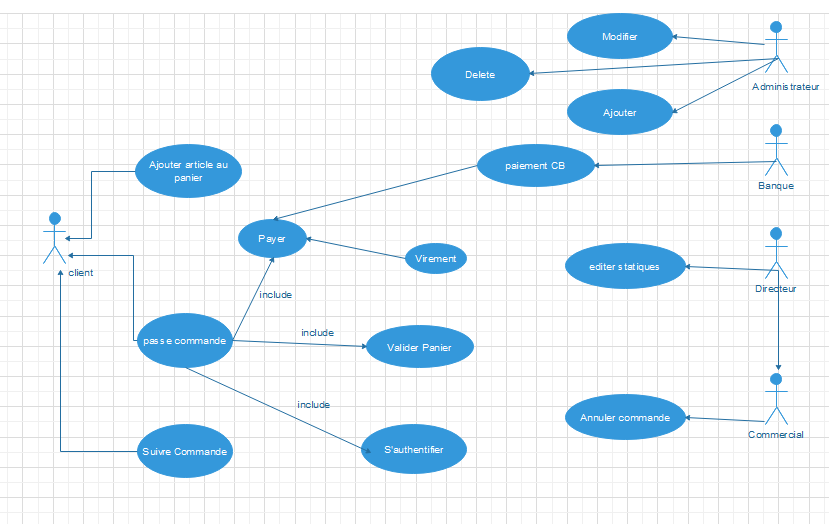
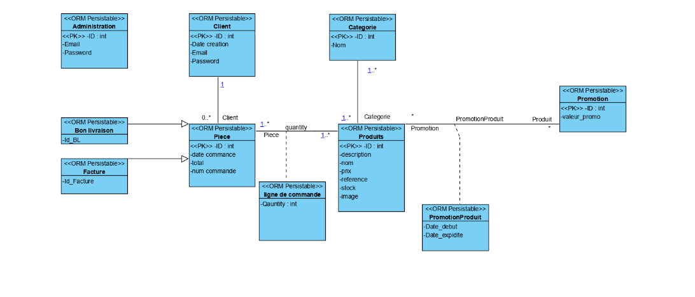
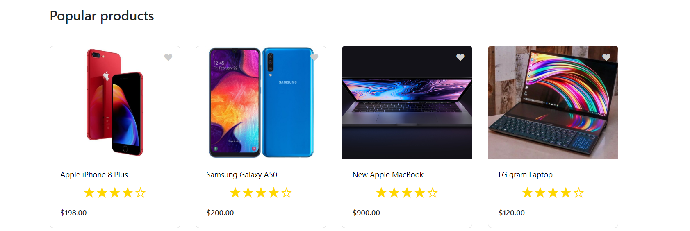

# EcommerceApp
Pour le projet angular il faut installer les dépendance par la commande :
npm i

Pour asp.net webApi il faut créer une nouvelle base de donnée nommé :
EcommerceDB 
coller dasn votre base donnée "EcommerceDB" script SQL qui se trouve dans le dossier "MyEcommerceAPP"
execute pour générer les tableau :

-- --------------------------------------------------
-- Entity Designer DDL Script for SQL Server 2005, 2008, 2012 and Azure
-- --------------------------------------------------
-- Date Created: 02/02/2020 19:49:57
-- Generated from EDMX file: C:\Users\Youcode\source\repos\MyEcommerceAPP\MyEcommerceAPP\Models\Model1.edmx
-- --------------------------------------------------

SET QUOTED_IDENTIFIER OFF;
GO
USE [ECOMMERCEDB];
GO
IF SCHEMA_ID(N'dbo') IS NULL EXECUTE(N'CREATE SCHEMA [dbo]');
GO

-- --------------------------------------------------
-- Dropping existing FOREIGN KEY constraints
-- --------------------------------------------------

IF OBJECT_ID(N'[dbo].[FK_PromotionProduit_Promotion]', 'F') IS NOT NULL
    ALTER TABLE [dbo].[PromotionProduit] DROP CONSTRAINT [FK_PromotionProduit_Promotion];
GO
IF OBJECT_ID(N'[dbo].[FK_FKPiece681709]', 'F') IS NOT NULL
    ALTER TABLE [dbo].[Piece] DROP CONSTRAINT [FK_FKPiece681709];
GO
IF OBJECT_ID(N'[dbo].[FK_PromotionProduit_Produit]', 'F') IS NOT NULL
    ALTER TABLE [dbo].[PromotionProduit] DROP CONSTRAINT [FK_PromotionProduit_Produit];
GO
IF OBJECT_ID(N'[dbo].[FK_quantity2]', 'F') IS NOT NULL
    ALTER TABLE [dbo].[ligne_de_commande] DROP CONSTRAINT [FK_quantity2];
GO
IF OBJECT_ID(N'[dbo].[FK_Categorie_Produits_Produits]', 'F') IS NOT NULL
    ALTER TABLE [dbo].[Categorie_Produits] DROP CONSTRAINT [FK_Categorie_Produits_Produits];
GO
IF OBJECT_ID(N'[dbo].[FK_Categorie_Produits_Categorie]', 'F') IS NOT NULL
    ALTER TABLE [dbo].[Categorie_Produits] DROP CONSTRAINT [FK_Categorie_Produits_Categorie];
GO
IF OBJECT_ID(N'[dbo].[FK_dbo_AspNetUserClaims_dbo_AspNetUsers_UserId]', 'F') IS NOT NULL
    ALTER TABLE [dbo].[AspNetUserClaims] DROP CONSTRAINT [FK_dbo_AspNetUserClaims_dbo_AspNetUsers_UserId];
GO
IF OBJECT_ID(N'[dbo].[FK_dbo_AspNetUserLogins_dbo_AspNetUsers_UserId]', 'F') IS NOT NULL
    ALTER TABLE [dbo].[AspNetUserLogins] DROP CONSTRAINT [FK_dbo_AspNetUserLogins_dbo_AspNetUsers_UserId];
GO
IF OBJECT_ID(N'[dbo].[FK_AspNetUserRoles_AspNetRoles]', 'F') IS NOT NULL
    ALTER TABLE [dbo].[AspNetUserRoles] DROP CONSTRAINT [FK_AspNetUserRoles_AspNetRoles];
GO
IF OBJECT_ID(N'[dbo].[FK_AspNetUserRoles_AspNetUsers]', 'F') IS NOT NULL
    ALTER TABLE [dbo].[AspNetUserRoles] DROP CONSTRAINT [FK_AspNetUserRoles_AspNetUsers];
GO

-- --------------------------------------------------
-- Dropping existing tables
-- --------------------------------------------------

IF OBJECT_ID(N'[dbo].[Administration]', 'U') IS NOT NULL
    DROP TABLE [dbo].[Administration];
GO
IF OBJECT_ID(N'[dbo].[Categorie]', 'U') IS NOT NULL
    DROP TABLE [dbo].[Categorie];
GO
IF OBJECT_ID(N'[dbo].[ligne_de_commande]', 'U') IS NOT NULL
    DROP TABLE [dbo].[ligne_de_commande];
GO
IF OBJECT_ID(N'[dbo].[Promotion]', 'U') IS NOT NULL
    DROP TABLE [dbo].[Promotion];
GO
IF OBJECT_ID(N'[dbo].[PromotionProduit]', 'U') IS NOT NULL
    DROP TABLE [dbo].[PromotionProduit];
GO
IF OBJECT_ID(N'[dbo].[Client]', 'U') IS NOT NULL
    DROP TABLE [dbo].[Client];
GO
IF OBJECT_ID(N'[dbo].[Piece]', 'U') IS NOT NULL
    DROP TABLE [dbo].[Piece];
GO
IF OBJECT_ID(N'[dbo].[Produits]', 'U') IS NOT NULL
    DROP TABLE [dbo].[Produits];
GO
IF OBJECT_ID(N'[dbo].[C__MigrationHistory]', 'U') IS NOT NULL
    DROP TABLE [dbo].[C__MigrationHistory];
GO
IF OBJECT_ID(N'[dbo].[AspNetRoles]', 'U') IS NOT NULL
    DROP TABLE [dbo].[AspNetRoles];
GO
IF OBJECT_ID(N'[dbo].[AspNetUserClaims]', 'U') IS NOT NULL
    DROP TABLE [dbo].[AspNetUserClaims];
GO
IF OBJECT_ID(N'[dbo].[AspNetUserLogins]', 'U') IS NOT NULL
    DROP TABLE [dbo].[AspNetUserLogins];
GO
IF OBJECT_ID(N'[dbo].[AspNetUsers]', 'U') IS NOT NULL
    DROP TABLE [dbo].[AspNetUsers];
GO
IF OBJECT_ID(N'[dbo].[Categorie_Produits]', 'U') IS NOT NULL
    DROP TABLE [dbo].[Categorie_Produits];
GO
IF OBJECT_ID(N'[dbo].[AspNetUserRoles]', 'U') IS NOT NULL
    DROP TABLE [dbo].[AspNetUserRoles];
GO

-- --------------------------------------------------
-- Creating all tables
-- --------------------------------------------------

-- Creating table 'Administration'
CREATE TABLE [dbo].[Administration] (
    [ID] int IDENTITY(1,1) NOT NULL,
    [Email] varchar(255)  NULL,
    [Password] varchar(255)  NULL
);
GO

-- Creating table 'Categorie'
CREATE TABLE [dbo].[Categorie] (
    [ID] int IDENTITY(1,1) NOT NULL,
    [Nom] varchar(255)  NULL
);
GO

-- Creating table 'ligne_de_commande'
CREATE TABLE [dbo].[ligne_de_commande] (
    [Qauntity] int  NOT NULL,
    [PieceID] int  NOT NULL,
    [ProduitsID] int  NOT NULL
);
GO

-- Creating table 'Promotion'
CREATE TABLE [dbo].[Promotion] (
    [ID] int IDENTITY(1,1) NOT NULL,
    [ValeurPromotion] float  NULL
);
GO

-- Creating table 'PromotionProduit'
CREATE TABLE [dbo].[PromotionProduit] (
    [PromotionID] int  NOT NULL,
    [ProduitsID] int  NOT NULL,
    [DateDebut] datetime  NULL,
    [DateExpidite] datetime  NULL
);
GO

-- Creating table 'Client'
CREATE TABLE [dbo].[Client] (
    [ID] int IDENTITY(1,1) NOT NULL,
    [Email] varchar(255)  NULL,
    [Password] varchar(255)  NULL,
    [Nom] varchar(255)  NULL,
    [Prenom] varchar(255)  NULL,
    [AdressFacturation] varchar(255)  NULL,
    [DateCreation] datetime  NULL,
    [AdressBonLivraison] varchar(50)  NULL
);
GO

-- Creating table 'Piece'
CREATE TABLE [dbo].[Piece] (
    [ID] int IDENTITY(1,1) NOT NULL,
    [ClientID] int  NOT NULL,
    [Total] int  NULL,
    [DateCommande] datetime  NULL,
    [NumCommande] int  NULL,
    [IdFacture] int  NULL
);
GO

-- Creating table 'Produits'
CREATE TABLE [dbo].[Produits] (
    [ID] int IDENTITY(1,1) NOT NULL,
    [Nom] varchar(250)  NULL,
    [Description] varchar(80)  NULL,
    [Prix] float  NULL,
    [Stock] int  NULL,
    [Image] varchar(300)  NULL
);
GO

-- Creating table 'C__MigrationHistory'
CREATE TABLE [dbo].[C__MigrationHistory] (
    [MigrationId] nvarchar(150)  NOT NULL,
    [ContextKey] nvarchar(300)  NOT NULL,
    [Model] varbinary(max)  NOT NULL,
    [ProductVersion] nvarchar(32)  NOT NULL
);
GO

-- Creating table 'AspNetRoles'
CREATE TABLE [dbo].[AspNetRoles] (
    [Id] nvarchar(128)  NOT NULL,
    [Name] nvarchar(256)  NOT NULL
);
GO

-- Creating table 'AspNetUserClaims'
CREATE TABLE [dbo].[AspNetUserClaims] (
    [Id] int IDENTITY(1,1) NOT NULL,
    [UserId] nvarchar(128)  NOT NULL,
    [ClaimType] nvarchar(max)  NULL,
    [ClaimValue] nvarchar(max)  NULL
);
GO

-- Creating table 'AspNetUserLogins'
CREATE TABLE [dbo].[AspNetUserLogins] (
    [LoginProvider] nvarchar(128)  NOT NULL,
    [ProviderKey] nvarchar(128)  NOT NULL,
    [UserId] nvarchar(128)  NOT NULL
);
GO

-- Creating table 'AspNetUsers'
CREATE TABLE [dbo].[AspNetUsers] (
    [Id] nvarchar(128)  NOT NULL,
    [Email] nvarchar(256)  NULL,
    [EmailConfirmed] bit  NOT NULL,
    [PasswordHash] nvarchar(max)  NULL,
    [SecurityStamp] nvarchar(max)  NULL,
    [PhoneNumber] nvarchar(max)  NULL,
    [PhoneNumberConfirmed] bit  NOT NULL,
    [TwoFactorEnabled] bit  NOT NULL,
    [LockoutEndDateUtc] datetime  NULL,
    [LockoutEnabled] bit  NOT NULL,
    [AccessFailedCount] int  NOT NULL,
    [UserName] nvarchar(256)  NOT NULL
);
GO

-- Creating table 'Categorie_Produits'
CREATE TABLE [dbo].[Categorie_Produits] (
    [Produits_ID] int  NOT NULL,
    [Categorie_ID] int  NOT NULL
);
GO

-- Creating table 'AspNetUserRoles'
CREATE TABLE [dbo].[AspNetUserRoles] (
    [AspNetRoles_Id] nvarchar(128)  NOT NULL,
    [AspNetUsers_Id] nvarchar(128)  NOT NULL
);
GO

-- --------------------------------------------------
-- Creating all PRIMARY KEY constraints
-- --------------------------------------------------

-- Creating primary key on [ID] in table 'Administration'
ALTER TABLE [dbo].[Administration]
ADD CONSTRAINT [PK_Administration]
    PRIMARY KEY CLUSTERED ([ID] ASC);
GO

-- Creating primary key on [ID] in table 'Categorie'
ALTER TABLE [dbo].[Categorie]
ADD CONSTRAINT [PK_Categorie]
    PRIMARY KEY CLUSTERED ([ID] ASC);
GO

-- Creating primary key on [Qauntity], [PieceID], [ProduitsID] in table 'ligne_de_commande'
ALTER TABLE [dbo].[ligne_de_commande]
ADD CONSTRAINT [PK_ligne_de_commande]
    PRIMARY KEY CLUSTERED ([Qauntity], [PieceID], [ProduitsID] ASC);
GO

-- Creating primary key on [ID] in table 'Promotion'
ALTER TABLE [dbo].[Promotion]
ADD CONSTRAINT [PK_Promotion]
    PRIMARY KEY CLUSTERED ([ID] ASC);
GO

-- Creating primary key on [PromotionID], [ProduitsID] in table 'PromotionProduit'
ALTER TABLE [dbo].[PromotionProduit]
ADD CONSTRAINT [PK_PromotionProduit]
    PRIMARY KEY CLUSTERED ([PromotionID], [ProduitsID] ASC);
GO

-- Creating primary key on [ID] in table 'Client'
ALTER TABLE [dbo].[Client]
ADD CONSTRAINT [PK_Client]
    PRIMARY KEY CLUSTERED ([ID] ASC);
GO

-- Creating primary key on [ID] in table 'Piece'
ALTER TABLE [dbo].[Piece]
ADD CONSTRAINT [PK_Piece]
    PRIMARY KEY CLUSTERED ([ID] ASC);
GO

-- Creating primary key on [ID] in table 'Produits'
ALTER TABLE [dbo].[Produits]
ADD CONSTRAINT [PK_Produits]
    PRIMARY KEY CLUSTERED ([ID] ASC);
GO

-- Creating primary key on [MigrationId], [ContextKey] in table 'C__MigrationHistory'
ALTER TABLE [dbo].[C__MigrationHistory]
ADD CONSTRAINT [PK_C__MigrationHistory]
    PRIMARY KEY CLUSTERED ([MigrationId], [ContextKey] ASC);
GO

-- Creating primary key on [Id] in table 'AspNetRoles'
ALTER TABLE [dbo].[AspNetRoles]
ADD CONSTRAINT [PK_AspNetRoles]
    PRIMARY KEY CLUSTERED ([Id] ASC);
GO

-- Creating primary key on [Id] in table 'AspNetUserClaims'
ALTER TABLE [dbo].[AspNetUserClaims]
ADD CONSTRAINT [PK_AspNetUserClaims]
    PRIMARY KEY CLUSTERED ([Id] ASC);
GO

-- Creating primary key on [LoginProvider], [ProviderKey], [UserId] in table 'AspNetUserLogins'
ALTER TABLE [dbo].[AspNetUserLogins]
ADD CONSTRAINT [PK_AspNetUserLogins]
    PRIMARY KEY CLUSTERED ([LoginProvider], [ProviderKey], [UserId] ASC);
GO

-- Creating primary key on [Id] in table 'AspNetUsers'
ALTER TABLE [dbo].[AspNetUsers]
ADD CONSTRAINT [PK_AspNetUsers]
    PRIMARY KEY CLUSTERED ([Id] ASC);
GO

-- Creating primary key on [Produits_ID], [Categorie_ID] in table 'Categorie_Produits'
ALTER TABLE [dbo].[Categorie_Produits]
ADD CONSTRAINT [PK_Categorie_Produits]
    PRIMARY KEY CLUSTERED ([Produits_ID], [Categorie_ID] ASC);
GO

-- Creating primary key on [AspNetRoles_Id], [AspNetUsers_Id] in table 'AspNetUserRoles'
ALTER TABLE [dbo].[AspNetUserRoles]
ADD CONSTRAINT [PK_AspNetUserRoles]
    PRIMARY KEY CLUSTERED ([AspNetRoles_Id], [AspNetUsers_Id] ASC);
GO

-- --------------------------------------------------
-- Creating all FOREIGN KEY constraints
-- --------------------------------------------------

-- Creating foreign key on [PromotionID] in table 'PromotionProduit'
ALTER TABLE [dbo].[PromotionProduit]
ADD CONSTRAINT [FK_PromotionProduit_Promotion]
    FOREIGN KEY ([PromotionID])
    REFERENCES [dbo].[Promotion]
        ([ID])
    ON DELETE NO ACTION ON UPDATE NO ACTION;
GO

-- Creating foreign key on [ClientID] in table 'Piece'
ALTER TABLE [dbo].[Piece]
ADD CONSTRAINT [FK_FKPiece681709]
    FOREIGN KEY ([ClientID])
    REFERENCES [dbo].[Client]
        ([ID])
    ON DELETE NO ACTION ON UPDATE NO ACTION;
GO

-- Creating non-clustered index for FOREIGN KEY 'FK_FKPiece681709'
CREATE INDEX [IX_FK_FKPiece681709]
ON [dbo].[Piece]
    ([ClientID]);
GO

-- Creating foreign key on [ProduitsID] in table 'PromotionProduit'
ALTER TABLE [dbo].[PromotionProduit]
ADD CONSTRAINT [FK_PromotionProduit_Produit]
    FOREIGN KEY ([ProduitsID])
    REFERENCES [dbo].[Produits]
        ([ID])
    ON DELETE NO ACTION ON UPDATE NO ACTION;
GO

-- Creating non-clustered index for FOREIGN KEY 'FK_PromotionProduit_Produit'
CREATE INDEX [IX_FK_PromotionProduit_Produit]
ON [dbo].[PromotionProduit]
    ([ProduitsID]);
GO

-- Creating foreign key on [ProduitsID] in table 'ligne_de_commande'
ALTER TABLE [dbo].[ligne_de_commande]
ADD CONSTRAINT [FK_quantity2]
    FOREIGN KEY ([ProduitsID])
    REFERENCES [dbo].[Produits]
    ([ID])
    ON DELETE NO ACTION ON UPDATE NO ACTION;
GO

-- Creating non-clustered index for FOREIGN KEY 'FK_quantity2'
CREATE INDEX [IX_FK_quantity2]
ON [dbo].[ligne_de_commande]
    ([ProduitsID]);
GO

-- Creating foreign key on [Produits_ID] in table 'Categorie_Produits'
ALTER TABLE [dbo].[Categorie_Produits]
ADD CONSTRAINT [FK_Categorie_Produits_Produits]
    FOREIGN KEY ([Produits_ID])
    REFERENCES [dbo].[Produits]
        ([ID])
    ON DELETE NO ACTION ON UPDATE NO ACTION;
GO

-- Creating foreign key on [Categorie_ID] in table 'Categorie_Produits'
ALTER TABLE [dbo].[Categorie_Produits]
ADD CONSTRAINT [FK_Categorie_Produits_Categorie]
    FOREIGN KEY ([Categorie_ID])
    REFERENCES [dbo].[Categorie]
        ([ID])
    ON DELETE NO ACTION ON UPDATE NO ACTION;
GO

-- Creating non-clustered index for FOREIGN KEY 'FK_Categorie_Produits_Categorie'
CREATE INDEX [IX_FK_Categorie_Produits_Categorie]
ON [dbo].[Categorie_Produits]
    ([Categorie_ID]);
GO

-- Creating foreign key on [UserId] in table 'AspNetUserClaims'
ALTER TABLE [dbo].[AspNetUserClaims]
ADD CONSTRAINT [FK_dbo_AspNetUserClaims_dbo_AspNetUsers_UserId]
    FOREIGN KEY ([UserId])
    REFERENCES [dbo].[AspNetUsers]
        ([Id])
    ON DELETE CASCADE ON UPDATE NO ACTION;
GO

-- Creating non-clustered index for FOREIGN KEY 'FK_dbo_AspNetUserClaims_dbo_AspNetUsers_UserId'
CREATE INDEX [IX_FK_dbo_AspNetUserClaims_dbo_AspNetUsers_UserId]
ON [dbo].[AspNetUserClaims]
    ([UserId]);
GO

-- Creating foreign key on [UserId] in table 'AspNetUserLogins'
ALTER TABLE [dbo].[AspNetUserLogins]
ADD CONSTRAINT [FK_dbo_AspNetUserLogins_dbo_AspNetUsers_UserId]
    FOREIGN KEY ([UserId])
    REFERENCES [dbo].[AspNetUsers]
        ([Id])
    ON DELETE CASCADE ON UPDATE NO ACTION;
GO

-- Creating non-clustered index for FOREIGN KEY 'FK_dbo_AspNetUserLogins_dbo_AspNetUsers_UserId'
CREATE INDEX [IX_FK_dbo_AspNetUserLogins_dbo_AspNetUsers_UserId]
ON [dbo].[AspNetUserLogins]
    ([UserId]);
GO

-- Creating foreign key on [AspNetRoles_Id] in table 'AspNetUserRoles'
ALTER TABLE [dbo].[AspNetUserRoles]
ADD CONSTRAINT [FK_AspNetUserRoles_AspNetRoles]
    FOREIGN KEY ([AspNetRoles_Id])
    REFERENCES [dbo].[AspNetRoles]
        ([Id])
    ON DELETE NO ACTION ON UPDATE NO ACTION;
GO

-- Creating foreign key on [AspNetUsers_Id] in table 'AspNetUserRoles'
ALTER TABLE [dbo].[AspNetUserRoles]
ADD CONSTRAINT [FK_AspNetUserRoles_AspNetUsers]
    FOREIGN KEY ([AspNetUsers_Id])
    REFERENCES [dbo].[AspNetUsers]
        ([Id])
    ON DELETE NO ACTION ON UPDATE NO ACTION;
GO

-- Creating non-clustered index for FOREIGN KEY 'FK_AspNetUserRoles_AspNetUsers'
CREATE INDEX [IX_FK_AspNetUserRoles_AspNetUsers]
ON [dbo].[AspNetUserRoles]
    ([AspNetUsers_Id]);
GO

-- --------------------------------------------------
-- Script has ended
-- --------------------------------------------------

et il faut créer une nouvel connexion nommé:
EcommerceDBEntities
-----------------------------------------------------------------------------------------------------------------------------

## 1 - Contexte et définition du projet :

L’objectif est un projet d’un application e-commerce qui gère là les vendre du produit avec des fonctionnalités d’Up-sell et X-sell et aussi gérer les promotions du produit.

## 2 - Objectif du projet :

Faire Api d’un application e-commerce qui contient là les produits avec des fonctionnalités d’Up-sell et X-sell et aussi gérer les promotions du produit.

Créer le front end par angular ,et consommer api .

## 3 - Périmètre du projet :

Notre solution c'est une application vise à tout le monde. Qui, permet à les vendre acheter du produit avec des fonctionnalités d’Up-sell et X-sell et aussi gérer les promotions du produit. Ainsi Le site sera disponible en français. Et il sera intégralement « Responsive Design ».

 ## 4 – Description fonctionnelle des besoins :
 
 
Notre app doit bien évidemment comporter une boutique en ligne, Cette dernière doit par défaut afficher l'ensemble des produit mis en ligne depuis le back-office, et disponibles en stocks, classés par ordre de prix croissant. Une liste de filtres doit permettre d'affiner et de simplifier la recherche.
 La liste des filtres à proposer est la suivante :
-proposition de produits en fonction des promotions et de règles de prix.
- fonctionnalité et traitement de x-sell et up sell
 - Prix (type fourchette) 
 - Nos sélections (boutons à cocher) Depuis la liste de chaque produit, les utilisateurs doivent pouvoir :
 - Consulter la fiche du produit.

  ## 5 - Utilisation :

Client :
_description dans le site.
-Authentification.
-Voir tous les offres
-Choisir et demander les offres nécessaires.
-voir les prix et les promotions .
-Contacter le site. 

## 6 - Enveloppe budgétaire :

Partie conception :
Design UI/UX :
Partie front-end :
Partie back-end :

## 7 - Délais de réalisation :

Les délais sont estimés vers 30 jours.

## 8 - USE CASE : 

 
## 9 - Diagramme de class :

-----------------------------------------------------------------------------------------------------------
# design graphic du projet

## accueil:
............en cours de développement.

 
 
 
 -----------------------------------------------------------------------------------------------------------
 
 # Le projet Appliaction Ecommerce partie ASP.NET
 
Projet ASP.NET utilisant identité et entité Framework.

## Les packages installés : 
•	Microsoft.AspNet.WebApi.Cors.
•	Microsoft.AspNet.Identity.Core
•	EntityFramework
•	Miscrosoft.Owin.Cors
## Conception de Code : 
•	dossier contrôleur contients les contrôleurs.
•	Partie DATA sous forme d’une bibliothèque de classe qui contient un ADO lié avec notre base de données 
•	Partie LOGIQUE qui contient des traitements hors métiers.
## Les API à consommer :

### AUTHENTIFICATION :
on a fait juste la partie backend mais nous sommes encours travaille sur cette partie

#### •	Pour s’identifier il faut utiliser :
  ##### /token et envoyer au body :(Post)

##### -	"username=" + Le nom d’utilisateur + "& password d’utilisateur=" + password + "&grant_type=password” ;

#### •	Et envoyer au header une autorisation (Post)

#### •	Pour avoir les tous  produits il faut utiliser le lien (get) : 

##### api/produits.

#### •	Pour avoir un  produit par ID il faut utiliser le lien (get) : 

##### api/produits/id.
##### Pour avoir les tous categories il faut utiliser le lien (get) : 
#### •	Pour avoir un  categories par ID il faut utiliser le lien (get) : 

liste porduits

• ID: number;
• Nom:String;
• Prix:number;
• Image:string;

 
## Details Produit

• ID: number;
• Description:string;
• Nom:String;
• Prix:number;
• Image:string;
• PrixPromo:number
• Stock

 

List Ctagories

•    ID: number;
•   Nom:String;
 •  Image:string

list produits par categorie

•   Nom:String;
• Image:string;

------------------------------------------------------------------------------------------------------
barre recherche

[Screenshot ](img/search.png)

 

